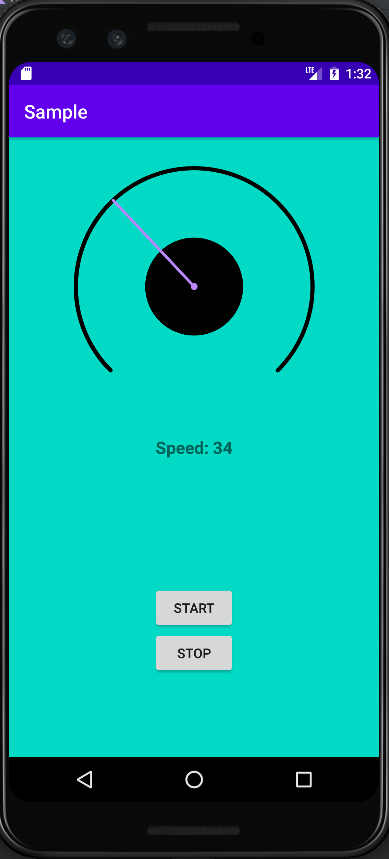
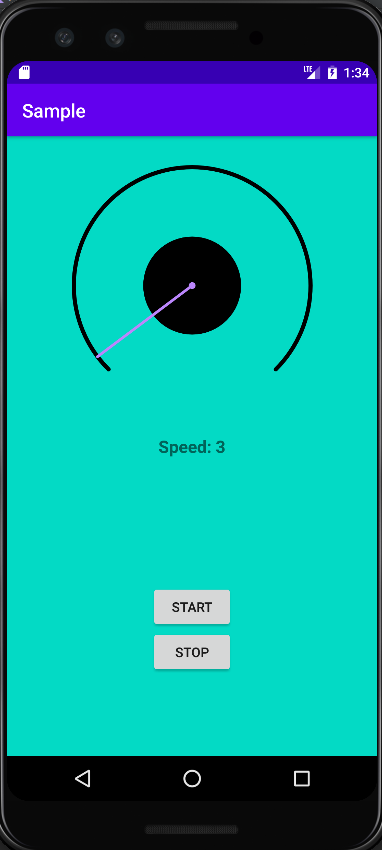
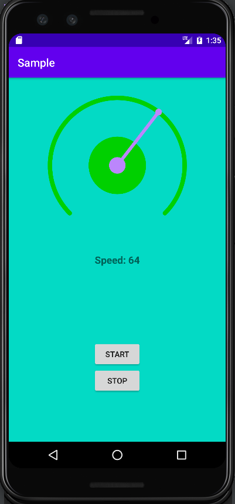

# CircularProgressBar
    Circular progress bar is a simple, easy-to-use speedometer-like circular progress bar.

  

## How to use
Add view to your layout:
```xml
<com.javavirys.circularprogressbar.CircularProgressBar
    android:id="@+id/progress"
    android:layout_width="260dp"
    android:layout_height="260dp"
    app:layout_constraintBottom_toTopOf="@+id/speedTextView"
    app:layout_constraintEnd_toEndOf="parent"
    app:layout_constraintStart_toStartOf="parent"
    app:layout_constraintTop_toTopOf="parent"
    app:outerArcWidth="8dp"
    app:outerArcColor="#00d000"
    app:lineWidth="6dp"
    app:lineColor="@color/purple_200"
    app:smallPointSize="12dp"
    app:bigPointSize="30dp" 
    app:progress="33" />
```

Than find it in code and set progress:
```kotlin
val circularProgress = findViewById<CircularProgressBar>(R.id.circular_progress)
// you can set current progress value
circularProgress.setProgress(value)
// You can set the progress value without animation
circularProgress.setProgressWithoutAnimation(value)
// you can get progress value using following getter
circularProgress.getProgress()
```

---

### Download using Gradle

Add this in your root `build.gradle` at the end of `repositories` in `allprojects` section:
```groovy
allprojects {
    repositories {
        maven { url 'https://jitpack.io' }
    }
}
```

Then add this dependency to your **module-level** `build.gradle` in `dependencies` section:
```groovy
implementation 'com.github.test:CircularProgressBar:1.0'
```

---

### License

```
   Copyright 2021 Vitaliy Sychov. All rights reserved.

   Licensed under the Apache License, Version 2.0 (the "License");
   you may not use this file except in compliance with the License.
   You may obtain a copy of the License at

       http://www.apache.org/licenses/LICENSE-2.0

   Unless required by applicable law or agreed to in writing, software
   distributed under the License is distributed on an "AS IS" BASIS,
   WITHOUT WARRANTIES OR CONDITIONS OF ANY KIND, either express or implied.
   See the License for the specific language governing permissions and
   limitations under the License.
```
